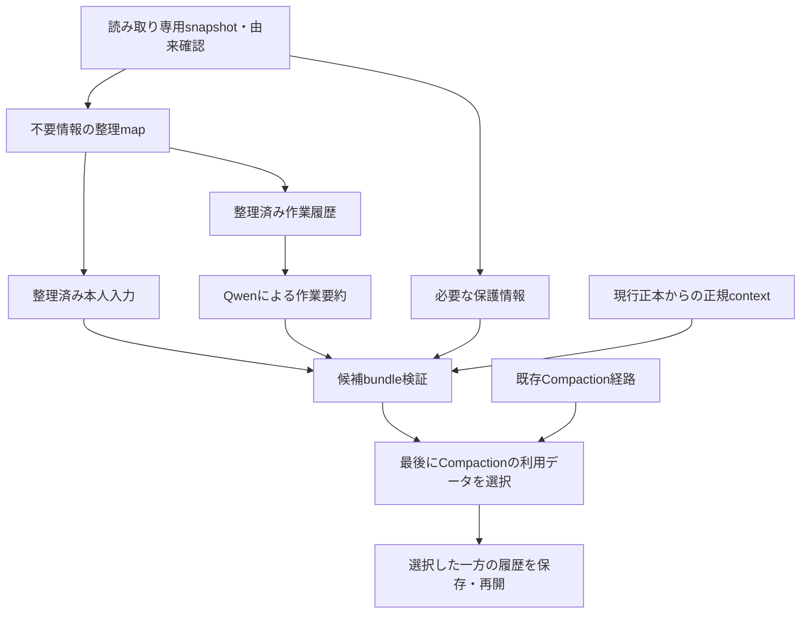

# RenCrow Switch Core Compaction仕様 v0.2

2026-09-22。状態: **実装中。別ラインCLIで部分選別・Qwen要約・最終候補を検証済み。稼働Compactionへの接続・配備は未完了**。
本書はFork内部のCompaction契約の正本。横断的な削減規則・受入は
[catalog仕様](../docs/codex-context-management.md)、改変・上流追従は[FORK_RULES.md](FORK_RULES.md)が所有する。
単独checkoutでcatalog参照がない場合も、本書の保護条件は適用する。横断仕様変更時はowner側と照合する。

## 1. 目的とシステム方針

RenCrow Switch CoreをCodex-switchの標準実行基盤とする。OpenAI Codexは上流として追従し、公式binaryは別に維持する。
不要な履歴を減らし、撤回済み命令の復活・完了作業の再実行を防ぎながら、現在の要求・能力・安全性・作業継続性を保持する。
Qwenで最初に検証するがモデル固有の削除規則にはしない。Astraでも適用対象経路を検証し、未検証のremote動作を同等と断定しない。

- Fork: 履歴snapshot、整理案の検証、入力構築、要約、履歴置換、再開・計測。
- LLM: 文脈を要する撤回・完了・矛盾の判定案と要約。実行sessionの実モデル・effortを維持する。
- launcher: binary選択と既存profile配備。Gateway/Backend: 通信・model実行。指示失効のownerにはしない。
- Toolsの外部整理CLI: 手動引き継ぎ・評価用。Forkの自動Compactionに接続済みとは扱わず、必須subprocessにしない。
- 保存済み会話・rollout・監査原本は編集・削除しない。整理対象はモデルへ渡す派生context。

現launcherはForkがなければ公式版へfallbackする。標準構成の目標は、RenCrow targetでForkを必須とし、欠落時は明示エラーにすること。
公式版の比較・復旧は明示選択だけとする。このlauncher変更は未実装。`openai` targetと既存公式sessionの自動移行は本仕様に含めない。

## 1.1 別ラインでの開発・接続境界（利用者訂正）

既存システムに手を入れる範囲を最小化する。まず独立した処理経路で派生データを作り、最後にCompactionが利用するデータを選択する。
「別ライン」は処理と成果物の分離を意味し、新しいGit branchや別の正本DBを作る指示ではない。

- 開発中は既存の会話保存・通常要求・Compaction・checkpoint・稼働profileを変更しない。稼働Qwenを実験のために再起動しない。
- 新経路は読み取り専用snapshotを入力とする。元の会話や進捗の正本を移さず、再生成可能な候補だけを出力する。
- 新経路は本人入力の整理、作業履歴の整理と要約、最終候補の検証を一方向に実行する。同じ整理mapを共有し、二つの系統で別々に失効判定しない。
- 既存の選別モジュールは新経路の部品として使う。既存history crateへの追加済みexport・依存を超えて、現行処理の挙動を先に書き換えない。
- 既存データに本人入力の由来情報があれば再利用する。足りない場合も、既存保存形式の大規模変更を前提にせず、将来の入力受付境界で必要最小限の由来付与を設計する。
- 最終接続時だけ、Compactionの入力選択境界と、保証上不可欠な保存・replay境界を変更する。hook・通常turn・Gatewayの各所へfilterを分散させない。
- 通常運用は既存経路を使用し続ける。新経路の開発成功は切替済みを意味しない。新経路を選ぶ場合は同一snapshotの検証済みbundleを一括採用し、古い保持user群を混ぜない。
- shadow比較は明示的な試験で行い、通常Compactionのたびに二重のLLM呼出しを常時追加しない。

## 1.2 本人入力の由来と最終利用データ

「本人入力」は、利用者の入力受付境界で確認された投稿に由来する内容。指示だけでなく質問・説明・引用・添付も含む。
`role=user`、`UserMessage`分類、文字列prefixだけでは本人入力と認定しない。アプリやagentの代理投稿、hook、host生成context、要約は本人入力と区別する。
受け付けた投稿でも、その中の引用・貼付コードを利用者からの有効命令に昇格しない。

由来は既存のhost metadataと入力受付の対応を根拠にする。判別不能な旧データは`unknown`として別に保護し、本人原文とは表示しない。
由来不足を補うために原本を後から書き換えない。由来分類と、内容の有効/撤回/完了の意味判断は別工程である。

| データ | 新経路での処理 | Compaction後の用途 |
| --- | --- | --- |
| 本人入力と確認できる投稿 | 同じ整理mapで撤回部分を除外、完了命令を結果化。有効要求・未解決部分・必要な添付を保持 | 別途保持する本人入力枠。生成文を原文として扱わない |
| AGENTS.md、権限・環境などのhost供給情報 | 現行の正規owner/context生成経路から取得 | 正規context枠。過去のuser群から再保持しない |
| assistant応答・tool結果・作業経過 | 不要履歴を整理し、必要な結果・証拠・未完了事項をQwenが要約 | 作業要約枠。本人の命令として再追加しない |
| 未完了tool、process、未確定の外部効果 | 要約だけでは失われる構造・参照を保護 | 継続に必須の構造化情報として保持 |
| 由来不明の旧データ | 推測で削除・本人認定しない。必要部分を元のrole/metadataとともに保持 | 由来不明の保護情報。本人入力枠に混入させない |
| 保存原本・過去の全ログ | 読み取り元・監査証跡として保存 | 全文を無条件にモデルへ再投入しない |

これらは論理的な用途区分であり、独立した六つのDBや新しいAPI roleを作る指定ではない。
候補bundleはsnapshot hash・整理map・各出力の由来を一緒に持つ。要約時は整理後の本人入力を判断の文脈として参照してよいが、要約に本人入力の全量コピーを要求しない。
最終候補は「現行の正規context＋整理済み本人入力＋作業要約＋必要な保護情報」とする。
既存phaseごとの投入順・role・tool call/result整合を維持し、構造化情報を保持できない場合は新経路の適用を拒否する。

## 2. コードで確認した現状

基点: `f96093ad9d3cd0d31a713789e99d7397a5bc0790`。以下は現行実装の説明で、改修後の保証ではない。

| 箇所 | 現状 | 改修境界 |
| --- | --- | --- |
| `codex-rs/core/src/compact.rs` / `run_compact_task_inner` | PreCompact→本体→成功時PostCompact | hook契約は維持。別経路を最終入力選択点から呼ぶ |
| 同 / `run_compact_task_inner_impl` | clone_historyへ要約指示を追加して要約要求 | 要約送信前にsnapshotから整理済み入力を生成 |
| 同 / `collect_annotated_user_messages`、`build_compacted_history_with_limit` | 元履歴からuserを収集し、直近側から概算20,000tokenまで再保持 | 生の元履歴からの再収集を止め、同じ整理結果から選択 |
| 同 / `replace_compacted_history`呼出 | initial contextと要約を含む履歴へ置換 | 検証済み候補だけを既存保存経路へ渡す |
| `codex-rs/core/src/session/turn.rs` | provider capabilityでlocal/remote V2分岐。TokenBudgetの別分岐あり | 発火経路ごとの対応を明示 |
| `codex-rs/core/src/compact_remote_v2.rs` | remote固有要求と保持履歴の構築、64,000token保持定数 | localの20,000token方式と混同しない |

PreCompactの通知や`compact_prompt`の変更だけでは、要約入力の物理的な整理と古いuser原文の再混入を両方解決できない。
現本体は要約後に履歴を再取得するため、単に要約直前へfilterを挿すだけでは本仕様を満たさない。

## 3. 処理順序と責務

| 工程 | 分類・owner | 入力→出力 | 失敗 |
| --- | --- | --- | --- |
| snapshot/整形 | CLI・Fork | 現履歴/設定/境界→hash付き項目集合 | `stale`/`blocked`、適用なし |
| 整理案 | LLM・同じ実モデル | 項目と証拠→参照付き操作案 | 不明はkeep、schema不正は拒否 |
| 選別 | CLI/Boundary・Fork | 案とsnapshot→検証済み派生view | 不正参照・権限逸脱は`rejected` |
| 要約 | LLM・同じ実モデル | 派生view→由来付き要約候補 | timeout/不正内容は確定しない |
| 候補検証/保存 | Boundary・Fork | 同じview＋要約→replacement checkpoint | 競合・保存失敗は成功にしない |
| 測定 | CLI・Fork/既存集計 | response ID/usage/受入→結果 | 不足は未測定 |

CLIはFork内の決定的処理を意味し、外部CLI起動の増設を要求しない。
意味判定は文字列比較だけで安全に決められないためLLMを使う。参照解決やhash検証をLLMへ委ねない。
初期設計では整理と要約を分ける。整理要求自身の入力・出力費用も必ず測定し、追加LLM呼出しを無料と扱わない。

## 4. snapshot・整理案の契約

snapshotはsession、履歴revision/hash、turn境界、config/model/provider識別、checkpoint祖先を固定する。
項目参照は既存item IDと原文hashを使い、IDがない場合だけsnapshot内位置を組み合わせる。
本文内の複数指示はUTF-8の境界を守る範囲参照に分ける。メッセージ丸ごとの削除で残る有効指示を失わない。
権限・role・由来・適用scope・元の順序・tool call ID・添付参照を保持する。時刻だけで有効性を決めない。

整理案の最小schema（名称は実装時にconfig/schemaへ固定する。現在のCLI fieldではない）:

| field | 内容 |
| --- | --- |
| `schema_version`, `snapshot_hash` | 対象契約と入力固定 |
| `operations[].source_refs` | 元item/range/hash。重複範囲・存在しない参照を拒否 |
| `operations[].action` | `keep` / `drop` / `replace_with_result` / `merge` / `reference` |
| `operations[].state` | `active` / `superseded` / `completed` / `unresolved` / `context` |
| `operations[].evidence_refs` | 訂正元、置換先、完了証拠、参照先 |
| `operations[].replacement` | 保持する意味・結果と原文の対応。自由な命令追加は禁止 |

操作がない範囲はkeep。不明・低確信はunresolvedとしてkeepし、確信度数値だけではdropしない。
CLIが保証できるのはschema・参照・権限・対応関係等の整合性であり、意味判定の正しさそのものではない。
削除は明示訂正と対象対応があるものに限定し、暗黙の「もう不要だろう」を根拠にしない。
完了は要求と有効な実行証拠の対応が必要。assistantの成功宣言だけならcompletedへ移さない。
意味的に曖昧なreplacementも採用せず元の範囲を保持する。

## 5. 削減と保護

削減対象の全体分類は[catalog §5](../docs/codex-context-management.md#5-削減規則)を正本とする。
Forkの適用条件は次のとおり。

- 撤回/置換された指示は命令本文を除外し、現行指示と必要な失効関係を残す。
- 完了した単発指示は結果・証拠・無効化条件へ変換する。継続制約は完了扱いにしない。
- 重複、旧計画、古いsnapshot、途中報告、解消済みエラー、不採用案、探索ログは、後続判断に必要な結果と参照へまとめる。
- 大きなtool出力、全文貼付、反復データは再取得可能性と取得権限が確認できる部分だけ参照化する。未保存・消失予定の出力は残す。
- 画像・添付・引用・コード・分析内容を、利用者の新たな命令や撤回として扱わない。マルチモーダル入力をテキストだけへ変換して能力を落とさない。
- 有効要求、受入条件、owner、役割、権限、認証/policy、branch/dirty、稼働版との差、未完了/阻害、復旧条件、未確定の外部効果は保護する。
- 未完了toolと必要なcall/resultの組、継続中processのID・cwd・取得方法は保護する。孤立tool結果を作らない。
- 旧要約も判定対象。旧要約の「次に実施」を現行の要求より優先しない。過去checkpoint由来の失効範囲をresumeや再圧縮で復活させない。
- 実行中の最新要求を境界の外へ取り落とさない。到着した訂正を古いsnapshotに適用済みと偽らない。

## 6. 要約とreplacement history

別経路で整理viewを作り、その後の**別の要約生成要求**へ作業履歴を渡す。Qwenによる要約はこの後段である。既存の要約本体を先に書き換える方針は、§1.1の利用者訂正で置き換える。
整理viewには現行目的/制約、確認済み結果/証拠、未完了/阻害/不確実性、進行中処理、次の判断に必要な参照を含める。
要約には各要求・結果のsource参照を対応させる。通常応答・tool構文・追加命令を要約成功として保存しない。

replacementの利用データは§1.2の表に従う。本人入力と確認できる原文だけを本人入力枠に置き、作業要約・host context・由来不明の保護情報とは区別する。
**要約側と本人入力側の失効判定は同じ整理mapを使う。元履歴からrole=userやUserMessage分類だけで原文を再追加しない。**
既存role/metadata/identityの契約を維持し、生成した文を利用者の原文や高権限指示と偽装しない。
削除済みの本文は要約、保持原文、添付の抜粋、旧要約由来の再構築からも復活させない。監査用の原本参照は残してよい。

要約候補の参照coverage・必須項目・不正tool構文を機械検証する。意味的一致は同じモデルによる検証要求を上限1回行い、費用を含める。
機械検証とモデルの一致だけで安全性が証明されたとは扱わず、独立評価fixtureと実作業で欠落・誤失効を検証する。
検証が不確実なら元の範囲を残した候補を使うか、適用を中止する。再生成を無限反復しない。

System/Toolsの固定prefixに動的な整理状態を積まない。現行の正規developer/contextの再投入は既存owner経路を維持する。
保持容量を理由に保護対象を途中切断しない。収まらない場合は`blocked`を明示する。

## 7. 競合・永続化・失敗

候補作成中は現checkpointを有効とし、候補要約を通常履歴へ確定しない。
commit直前にsnapshotと履歴revisionを照合する。新しいuser訂正・tool結果・設定変更が入れば候補をstaleとして棄却する。
未確定の外部実行をcancel/再実行して整合を装わない。安全な区切りを待てなければ適用を延期する。

最終接続までは既存`replace_compacted_history`とrolloutを変更しない。接続時は必要な保存/再開境界に絞って拡張し、原本はappend-onlyで保持する。
整理mapはcheckpointに結び付いた派生metadataとして保存する。別の独立編集可能な指示台帳は作らない。
履歴と整理mapの片側だけをresumeで有効にしない。異常終了では最後の完全なcheckpointへ戻ることをfault injectionで確認する。
既存APIの存在だけでatomicityを保証済みとしない。書込み順・replay・flushの詳細は実装時の変更境界に含める。

| 状態 | 動作 |
| --- | --- |
| `applied` | 全検証と保存成功後のみPostCompact、通常作業へ復帰 |
| `stale` | 候補を破棄。最新境界からの再試行はこの発火につき1回まで |
| `rejected` | 不正schema/参照/権限/内容を明示、履歴置換なし |
| `blocked` | 容量・未解決の保護条件・非対応経路により適用不能 |
| `failed` / `interrupted` | 原因を返し、成功イベントを出さない。完全なcheckpointを維持 |

通常入力がまだ収まれば現履歴で継続できる。収まらなければ明示エラーで止め、同じ圧縮要求を無限に再送しない。
managed失敗時に黙って上流方式へ戻して「整理成功」としない。公式互換方式への切替は明示設定で行う。
再起動時に未確定候補を成功扱いにしない。旧binaryへ戻す際もwriter停止と保存形式確認を行い、新たな外部効果を巻き戻さない。

## 8. 対応経路と導入

設計上の設定は`rencrow.compaction.mode = upstream | managed`。**まだ存在する設定キーではない**。
初期buildは`upstream`を既定とし、試験環境でmanagedを明示選択する。受入後のRenCrow標準profileでmanagedを明示設定する。
モデル・effort・context上限・tool能力・sandbox・approvalは変更しない。

| 経路 | v0.1の扱い |
| --- | --- |
| local手動、自動pre/mid/post-turn、resume、連続圧縮 | 初期実装の必須受入。phaseごとのcontext投入を保持 |
| remote V2 | 次段の受入対象。opaqueなserver出力へ同じ整理保証を適用できるまでmanagedはunsupported |
| TokenBudget等の別経路 | 明示的に検出。未対応時のmanagedはunsupported |
| 公式互換mode | 上流の経路を維持し、不要指示除去の保証対象外と明示 |

remoteをlocalへ、AstraをQwenへ自動置換して成功にしない。Astraへの適用可否は実provider経路ごとに記録する。
既存Tools CLIの実行を前フックへ挿入して本仕様の実装済み扱いにしない。

## 9. 受入・効果測定

下表は将来の実装Check Planへ対応付ける要求IDであり、実行済み結果ではない。

| ID | 条件と証拠 |
| --- | --- |
| CMP-01 | 訂正された旧命令が要約入力・要約・replacement・次の通常入力の全てで有効命令として残らない |
| CMP-02 | 完了は結果化、未完了/継続制約は保持。自己申告だけの完了や無効証拠を拒否 |
| CMP-03 | 部分撤回、scope/role違い、引用の偽指示、曖昧な訂正で有効要求が欠落しない |
| CMP-04 | tool組・未完了process・画像/添付・外部効果・復旧条件を保持し、正規操作を継続できる |
| CMP-05 | stale、timeout、不正案、空/不正要約、容量不足、保存中断で誤ったcheckpointを確定しない |
| CMP-06 | 手動/自動各phase、resume、連続2回以上の圧縮で失効命令が復活しない |
| CMP-07 | 非対応remote/別経路を明示し、モデル・能力・権限・routeを変更しない |
| CMP-08 | 実Qwenの同じ失敗場面で、適切な次作業へ継続。Astra代行や成功申告で代用しない |
| CMP-09 | 同条件baselineとの総token・時間・保持品質・受入成果の比較ができる |
| CMP-10 | 本人入力・host生成・agent代理・引用・由来不明を区別し、本人入力枠への誤混入を防ぐ |
| CMP-11 | 別経路の実行が既存履歴・設定・通常Compactionを変更せず、最終選択で一方の完全なbundleだけを採用する |

fixtureは各保証の境界に絞る。実装時は関連unit→経路統合→実Qwenを依存順に一度実施し、失敗時は変更影響だけ再検証する。
稼働QwenのIdentity作業は検証fixtureのために破壊・再実行しない。保存済み限定fixtureで先に確認する。

測定対象は①通常の圧縮直前入力、②整理要求、③要約要求、④検証要求、⑤replacement、⑥圧縮後最初と継続後の通常入力。
response IDで重複を除き、API usageと推定token、cached inputの内数、reasoningを含むoutput、文字数を区別する。
CLI時間・モデル時間・圧縮間隔・再調査・誤った再実行も記録し、共有Backend tok/secをsession固有性能と混同しない。
同じsource履歴/model/effort/tools/provider/configのupstream baselineと比較し、整理・検証自身の費用を含む総量を報告する。
成功条件は保護項目の欠落・誤失効が評価対象で0、撤回命令の復活が0、元の作業受入を維持し、定義した継続作業までの総tokenがbaselineより減ること。
一回の圧縮率だけで恒常的な削減率を主張しない。費用が増えた場合は改善未達とし、規則を弱めず処理構成を見直す。
raw会話・認証情報をGitや通常ログへ複製しない。監査にはcheckpoint/hash/操作件数/理由code/response ID/証拠参照を残す。

## 10. 実装順序

1. 別経路でsnapshot・入力由来・整理map・純粋な選別と保護fixtureを実装する。
2. 整理済み本人入力と、整理済み作業履歴からのQwen要約を候補bundleへまとめる。既存Compactionにはまだ接続しない。
3. 保存済みfixtureで品質・総費用・既存状態の非変更を確認する。最終接続に必要な保存・競合・replayの変更範囲を確定する。
4. 最後にCompactionの利用データ選択と必要最小限の保存境界へ接続し、旧user群との混入防止・失敗・resumeを検証する。
5. 実Qwenの継続を確認して適用可否を判断する。remote/別経路はその契約ごとに別受入する。

### 第1工程時点の実装記録（2026-09-22、後続の現状は次節）

第1工程のコードは`codex-rs/history/src/compaction_plan.rs`が所有する。
`CompactionSnapshot::capture → CompactionPlan → SemanticReview → apply → CompactionView`の純粋な経路を追加した。
SHA-256は本文だけでなくhostのbinding・scope・kind・保護範囲・項目順も含む。既存workspaceのsha2を再利用し、Cargo.lockを更新した。

現schemaは`schema_version=1`、`snapshot_hash`、`operations`。
操作は`keep {source}`、`drop_superseded {source, correction}`、`replace_completed {source, evidence, result}`。
参照は`id/hash/range {start,end}`でUTF-8 byte境界を検証する。上記§4の概念schemaのうち、merge/reference等はまだ未実装。
semantic reviewは正確なplan hashと採用するoperation indexを持つ。不一致・重複・範囲外indexは拒否し、未採用の削除は原文を保持する。

hostが作る`SourceFragment`のkind/scope/保護範囲はモデルから受け取るschemaではない。
実履歴からの分類・保護範囲抽出とLLMによる整理/検証要求は**未接続**であり、モデルの自由な自己申告をhost分類に代用してはならない。
`ExecutionEvidence`という型だけで完了の意味が証明されるわけではなく、意味的対応は別レビューを要する。
`CompactionView`は保持原文と生成した完了結果を分離する。原本・rollout・稼働sessionは変更しない。

未完了: 履歴からのsnapshot構築、LLMとの接続、要約とreplacement双方への適用、失効mapの永続化、競合時の原子的commit、経路別拒否、実Qwenの比較受入。
現時点で`rencrow.compaction.mode`は未実装であり、削減が稼働中とは扱わない。第1工程の部分実装をCMP-01〜09の全体成功に昇格しない。

検証（第1工程のみ）: `just test --cargo-profile dev-small -p codex-history`は40件成功・skip 0（うち追加11件）。
`just fmt`、`just bazel-lock-update`、`git diff --check`成功。Bazel lockは更新処理後も差分なし。
根拠はGit外`target/fork-bootstrap/compaction-{plan-test,format,bazel-lock}.log`。
この試験は純粋な選別と既存history crateの回帰であり、実モデルによる無効指示判定・通常Compaction・総token削減の実証ではない。

今回のv0.2変更は別ライン開発と入力由来の設計更新。既存の40テスト成功はv0.1選別部品の証拠であり、CMP-10/11や本人入力の実抽出は未実装・未検証。

### 別ライン候補経路の実装（2026-09-22、fixture受入済み）

`codex-history::compaction_candidate`に、由来付き入力snapshot、共通整理view、作業要約の参照coverage検証、最終データ組立を追加。
独立binary `rencrow-compaction`の`capture / inspect / prepare / select`から使う。[CLI入力・運用契約](COMPACTION_CLI.md)を参照。
prepareは正規Gatewayのworker/highで整理→検証→要約→検証を行い、selectは入力hashを再照合して分離したデータを出す。
モデルの提案schemaは対象IDと意味判断のみ。CLIが固定snapshotからhash/byte参照を確定し、基礎ライブラリのCompactionPlanへ変換する。未知IDは拒否する。review hashも要求対象からCLIが生成する。
CLIは`source_text`の一意な原文一致から部分範囲も確定する。混在recordの有効部分は保持する。merge/referenceの自動整理は未接続。
既存Compaction、通常turn、session DB、稼働launcher/profileは変更していない。

旧rollout取込みはassistant textをwork、その他のresponse_itemをunknown＋opaqueとして保全する。TUI受付の別記録と受理照合を追加した。適用範囲は末尾の「送信入力の別系統と受理照合」を参照。
明示的なintake参照を持つhost作成snapshotを処理できることと、過去ログから人間本人を自動認定できることを区別する。
追加のmerge/reference操作、通常Compactionへの適用、checkpoint保存/replay、remote対応は引き続き未実装。

#### 実測・受入（2026-09-22）

文書情報: 本節はこの実装sessionの確認済み結果。正本は本仕様、実装は上記history moduleと独立CLI。
証拠はGit外の`target/fork-bootstrap/candidate-{tests,cli-tests,build-fixed,format}.log`、
`target/fork-bootstrap/candidate-trial/{bundle,selected,acceptance}.json`および`trace-3/`。
合成fixtureによる候補経路の受入であり、Identity作業の完了証拠や実ログの本人認定ではない。

| 検証 | 結果 |
|---|---|
| history crate | 46件pass、skip 0 |
| 独立CLI | 4件pass、skip 0。観測した要求形式/参照型の失敗を含む |
| 正規Gateway、worker/high | 整理→意味review→要約→要約reviewの4要求完了 |
| 最終選択 | 撤回済みrecordと完了依頼を除去、現行制約保持、完了結果と証跡参照を保持 |
| 保全 | 入力SHA-256不変、unknown原文保持、stale候補拒否、既存出力の上書き拒否 |
| 旧rollout取込み | user/toolはunknown＋opaque、assistant textはwork、不正JSONL拒否 |
| format / build / lock | just fmt、関連binary build、git diff --check成功。Bazel lock更新処理は差分なし |

本人入力本文は1,827→181 UTF-8 bytes（90.1%減）。要約でも旧指示を現行命令として復活させていないことを原文で確認した。
成功した4要求はinput 3,622 + output 3,095 = 6,717 tokens、壁時計合計53.642秒。reasoningはoutput内に含まれ、二重計上しない。

| 段階 | input | output（reasoning含む） | 秒 | output tok/壁時計秒 |
|---|---:|---:|---:|---:|
| plan | 867 | 750 | 16.140 | 46.47 |
| plan review | 1,178 | 702 | 12.277 | 57.18 |
| summary | 713 | 466 | 7.498 | 62.15 |
| summary review | 864 | 1,177 | 17.727 | 66.40 |

完了response IDは順に`chatcmpl-1790078197262`、`chatcmpl-1790078209545`、`chatcmpl-1790078217051`、`chatcmpl-1790078234777`。
成功試験のcached tokensは全要求0。修正前の不正schema応答2回もinput合計2,710・output合計3,740（6,450 tokens）を消費した。
従ってこの診断試験の観測済み推論費用は成功分を含め13,167 tokens。モデル実行前のHTTP 400は推論成功数へ含めない。
本文のbyte削減は総token費用の削減率ではない。通常Compactionとの同条件比較、継続作業、cache・失敗費用を含む実運用効果は未確認。

#### Failure Knowledge（同日のCLI実試験）

- **Failure**: 最初の要求はHTTP 400。その修正後はQwenの整理案が参照schema不適合で拒否された。
- **Problem**: 稼働sessionを変更せずに候補生成を完走できない。拒否応答の原文保存がなく初回の細部診断も不足した。
- **Cause**: Gatewayが必須とする`input[0].type="message"`をCLIが送っていなかった。次の失敗ではQwenが`source:"old"`等のIDを返したが、CLIはhash/range付きSourceRefを要求していた。対象選択自体は正しかった。証拠は`prepare-fixed.stderr`、`prepare-2.stderr`、`trace-2/plan.json`。
- **Lesson**: 意味判断に必要な出力と、snapshotから決定的に生成できる参照情報を分ける。モデルにhash転記をさせない。失敗を推測でBackendへ帰属させず、要求と応答を保存して照合する。
- **Invariant**: QwenはIDと意味判断を提案し、CLIが固定入力から参照・hashを生成する。未知ID、保護違反、stale、review不一致は拒否する。別model/routeへのfallbackや検査弱体化を行わない。
- **Enforcement**: 明示message type、strictなID提案schema、`bind_plan`、既存snapshot検査、任意のprivate `--trace-dir`。Gateway/Backendは変更していない。
- **Tests**: `responses_request_has_explicit_message_type_and_preserves_model_contract`、`id_only_proposal_binds_to_snapshot_and_rejects_unknown_ids`、関連4 CLI tests、46 history tests、および同一fixtureをQwen自身が完走した上記実測。

#### 現在の未完了境界

別ラインの候補生成と最終データ組立まで実装・fixture確認済み。入力受付との接続は末尾の追加記録を参照。merge/reference、稼働Compactionの保存境界、resume、remote、実作業の継続と総token比較は未完了。
通常Compactionや配備済みFork binaryへ本候補経路を接続しておらず、仕様全体完了とは扱わない。

### 部分削減とcapture保全の追加修正（2026-09-22）

CLIの`source_text`指定により、同じ本人投稿に有効指示・撤回済み指示・完了依頼・引用が混在する場合も、原文の部分範囲を選択できる。
LLMは対象文を原文のまま提案し、CLIが唯一の一致箇所からUTF-8 byte参照を生成する。空・不一致・複数一致（重複する一致も含む）は拒否する。
既存snapshotの保護・根拠・scope検査を意味review前に行い、検証不能な案にreview要求を追加しない。reviewには選択した原文も添える。

CLI 8件pass（skip 0）、build、format、diff check成功。history実装は変更しておらず、既存46件の証拠を再利用する。
証拠: Git外`target/fork-bootstrap/mixed-{cli-tests,build,format}.log`、`mixed-trial/{input,bundle,selected,acceptance}.json`と`trace/`。
合成fixtureを同じworker/highで実行し、混在投稿294→135 UTF-8 bytes。有効な認証/policy制約と引用を保護し、撤回文と完了依頼だけを除去した。
訂正文・unknown原文・入力ファイルSHA-256も不変。生成要約を独立に確認し、過去の作業メモの全体テスト方針を現行命令へ戻していないことを確認した。
4要求はinput 3,276 + output 9,635 = 12,911 tokens、162.890秒。各段階のoutput tok/壁時計秒は59.40、57.85、63.37、56.41。
response ID: `chatcmpl-1790079519914`、`chatcmpl-1790079568494`、`chatcmpl-1790079584434`、`chatcmpl-1790079593880`。
前回とは入力が異なるため、所要時間やtoken数の単純比較で改善/悪化を断定しない。部分削減の正しさを確認したもので、総費用削減の受入は未完了。

#### Capture Failure Knowledge

- **Failure / Problem**: 旧captureはresponse payloadだけを扱い、隣接metadataを欠落させ、圧縮・巻き戻し等の復元境界も読み飛ばしていた。古い履歴を復活させる危険があった。
- **Cause**: `codex-history/src/rollout_payload.rs`の`RolloutItemWire::ResponseItem`はpayloadとは別にmetadataを保存する。`core/src/session/rollout_reconstruction.rs`はCompacted/ThreadRolledBack等を解釈するが、CLIの単純なresponse_item走査にはその処理がなかった。
- **Lesson / Invariant**: 本人由来の推測と履歴復元を混同しない。host metadataを欠落させず、未対応の履歴境界を無視しない。
- **Enforcement**: captureを専用moduleへ分離し、unknownまたはmetadata付きresponseは元の行をopaque保護。圧縮、巻き戻し、retained context、agent通信、未知のrollout種類はownerでの再構築を要求して拒否する。
- **Tests**: `preserves_sibling_metadata_and_never_promotes_user_role`、`rejects_replay_boundaries_instead_of_reviving_old_history`。通常線形取込みの保全と未対応境界の拒否を確認。

#### 本人由来の未完了境界をコードで再確認

`protocol/src/turn_input.rs::TurnInput::UserInput`はcontent/client_idを持つが、人間本人か代理投稿かを保証するフィールドはない。
`protocol/src/protocol.rs::UserMessageEvent`のclient_idも本人認証の根拠ではない。
`history/src/lib.rs::CodexHarnessMetadata`にはuser_input_orderとinherited_user_messageがあるが、前者は受付順、後者は継承の印であり、人間本人の証明ではない。
`core/src/session/turn_input.rs`では代理由来のFunctionCallOutputにも受付順が付与される。従ってこれらだけでhumanへ自動昇格しない。
入力受付側の由来付与は以下の追加範囲で扱う。ownerの履歴復元との接続、checkpoint/resume、追加削減操作、通常Compaction適用と実運用費用比較は引き続き未完了。

### 送信入力の別系統と受理照合（2026-09-22）

以前の「本人由来自動取得は未接続」は旧実装の状態。現在の追加範囲はTUI入力受付から独立captureまで。
責務は次のように分離する。

- CLI: TUI composerで元本文・添付参照を取得し、送信時のthread/client IDと本文hashを私有ファイルへ固定する。
- Boundary: 起動時の操作者申告human/automation（未指定はunknown）を保持し、受理ログと照合する。本人性の意味推測や物理操作者の検出は行わない。
- CLI: 一致した本文・添付を別枠へ移す。派生候補から同じ本文のコピーだけを除去し、host情報・prepared画像・metadata・原ログを保持する。
- LLM: この取得・照合には利用しない。後段の撤回/完了の意味判断と要約だけが既存LLM処理を利用する。

ownerはForkの`history::input_intake`（記録契約）、TUIの`input_intake`（受付）、独立CLIの`intake`（受理照合）。
新protocolや通常Compactionの経路は追加しない。詳細な利用方法・失敗挙動・未対応境界はCOMPACTION_CLI.mdの送信本文・添付の節を正本とする。
記録先の不存在は由来不明、記録破損や受理不一致はcapture拒否とする。保存失敗で通常送信を偽装成功させず、由来記録の失敗を表示する。

受入条件: 本文/添付の抽出、host情報との分離、原本不変、重複本文なし、未受理/automation/継承の誤昇格なし、ID/hash不一致拒否、非上書き保存、既存TUI送信の回帰。
検証記録は以下を参照。通常Compaction接続、圧縮/rollback済み履歴、resume、実運用の総token比較は未完了のまま。

実送信で判明した接続差異: 現行Forkは`item_completed`の`UserMessageItem`を保存し、旧`user_message` eventは必ずしも残さない。
受理本文の再現はprotocol ownerの`UserMessageItem::message()`を利用し、独自の連結規則を増やさない。
また初回送信にも完全なworld_stateが存在する。初回の完全snapshotをopaque保護する取込みを追加し、
差分・二回目のsnapshot・完了turn後のsnapshotは復元未対応として拒否する。
再現test: `binds_persisted_user_item_completion_without_a_legacy_event`、`retains_initial_world_state_but_rejects_updates_without_replay`。

#### 入力別記録の検証結果

- history 47件を含む関連lib/CLI/TUI検査は5,486件実行、初回5,467成功・17失敗・2timeout（4skip）。新規の受付保存と照合検査は成功。
- 短い私有一時path、通常の端末設定で失敗19件だけを再検査し10件成功。`umask 0002`でRustの一時dirが0775になることを確認し、検査processだけ`umask 0077`にしてIDE接続7件成功。権限検査・timeout閾値・製品コードは緩和していない。
- 残る既存失敗はworktree 2件（ホストGit 2.34.1が`git worktree list -z`未対応）とKitty画像1件。後者はpathのBase64にも禁止判定語`cG5n`が現れることを再現した。上流テスト全成功・TUI release受入とは扱わない。
- 現行受理形式・初回world_state対応後の独立CLI検査は13/13成功。resume/forkの入力元フラグ継承は1/1成功。`just fmt`、`just fix`、dev-small両binary build、diff check成功。静的検査には既存の`expect("validated source")`警告が1件残る。
- 新TUIを独立CODEX_HOMEで`--no-daemon --rencrow-input-author human`として起動し、本文120 UTF-8 bytesとPNG画像1件を送信。同じGatewayのworker/highから「受付確認」を受信した。これは監督の自動操作による合成試験であり、物理的な本人確認ではない。
- 終了後、同じ実rolloutを新CLIが自動探索した受付記録と照合。human 1件・添付1件を抽出し、残余のunknownに元本文の二重コピーなし。prepared画像は同一、原ログSHA-256不変、受付file 0600／directory 0700を実確認。
- 応答`chatcmpl-1790084206042`はinput 7,135、output 19、total 7,154 tokens、turn 10.863秒、初tokenまで10.757秒。入力取得・照合自身のLLM呼出しは0。Compactionの節約率や生成速度比較の証拠にはしない。

証跡はGit外の`target/fork-bootstrap/intake-{tests,retry-tests,private-ipc-tests,resume-tests,final-cli-tests,build,final-cli-build,clippy,complete-format}.log`と、
`intake-trial/{acceptance,input,installation,usage}.json`、同directoryの独立homeに保存。fixture原文・添付・runtime log・binaryはcommitしない。
独立`rencrow-compaction`を更新し旧binaryを同試験directoryへ退避した。稼働TUIは従来SHA-256 `04159684a80c3751fa0903b81a04fa3d9b4b20550a4b86e927bf73b5b0e53c1d`のまま。
新TUI試験版のSHA-256は`18d2d5522c68e9a620613f725613de78e13d0287bf3c1019d33ac4a40b7abdaf`。
今回の入力別記録の受入と、未完了の通常Compaction接続・checkpoint/resume・履歴復元・総費用比較を区別する。
